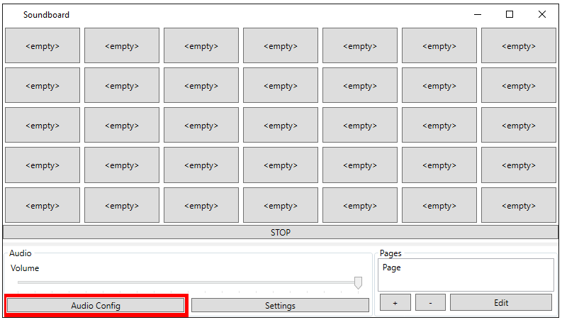
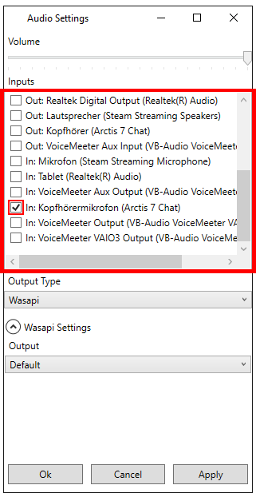
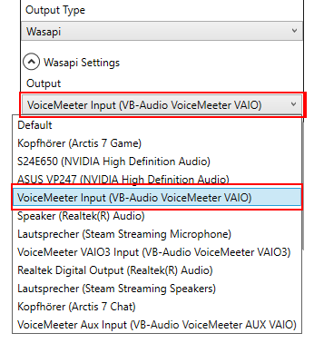
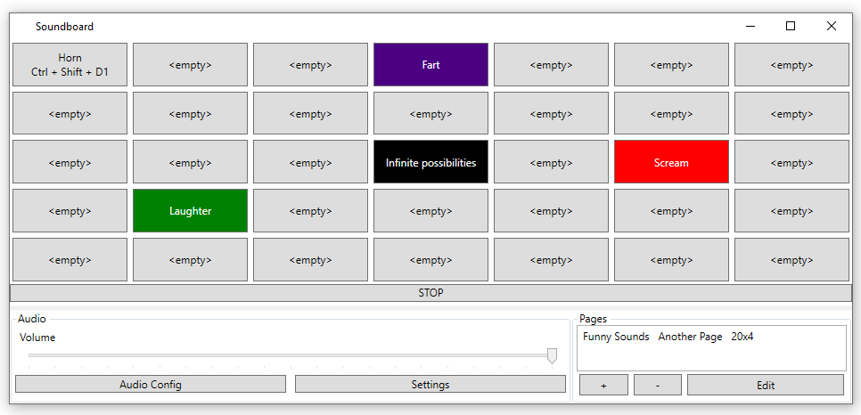
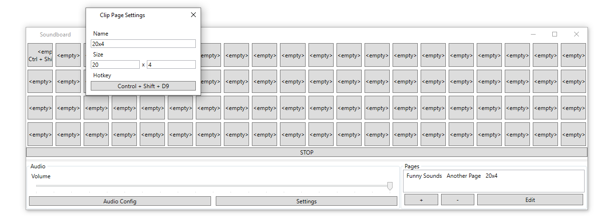
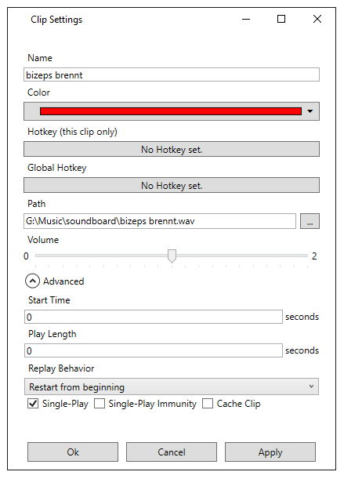
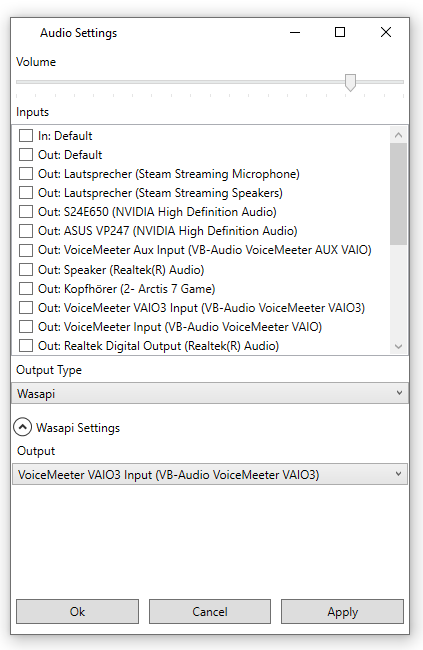

# WPF-Soundboard

Customizable and simple Soundboard for all your Soundboard-Needs.

## Setup

To *install* WPF-Soundboard, download 'release.zip' from [the latest release](https://github.com/fritz3n/WPF-Soundboard/releases/latest) and extract it.

To use this soundboard in a voice-communication programm like Teamspeak or Discord you need to get the sound output of this programm into a microphone input.
To accomplish this is recommend [VB-Audio Cable](https://vb-audio.com/Cable/). After install this or a similar tool simply follow this guide, substituting *tool input* and *tool output* with the audio devices installed by your tool.

First, open up the audio settings.

In the window that opens up, select any inputs you want be included in the output. This could be your microphone or your pc output.

Finally, in the same window, choose your *tool input* as output.

After hitting **save** you are good to go! Just select *tool output* as the input in your voice-communication programm and start using sounds!

## Screenshots

* The soundboard can be customized to fit your needs

* Infinitely many pages can be created with different names and sizes.

  
 
* Names, colors, and behavior can be modified for each individual Clip. Additionaly, global Hotkeys can be configured either for an individual Clip or for a position on every page.
* The clip audio can be output using Wasapi or Asio together with your selection of input or output devices.
